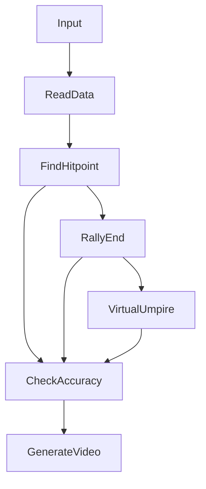

# Segmentation

## Usage

Input csv file,output a video that shows virtual umpire,hitpoint event and TrackNet's ball's position.

```
python3 segmentation.py
```

### Input csv format :
| Frame | Visibility | X | Y | Time |
| ----- | ---------- | --- | --- | ---- |
| 1 | 0 | 0 | 0 | 00:00:00.123 |
### Output :
- csv format :
  - | Set | Rally | Frame | X | Y | Time | Getpoint_player | Lose_reason |
    | --- | -------- | --- | --- | --- | --- | --- | --- |
    | 1 | 2 | 795 | 486 | 397 | 00:00:26.527 | B | 0 |

- virtual umpire video screenshot :


## Flow Chart

